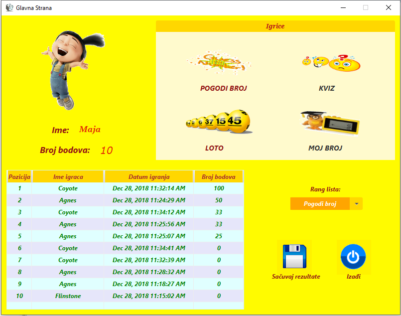
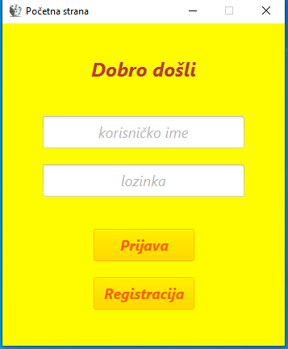
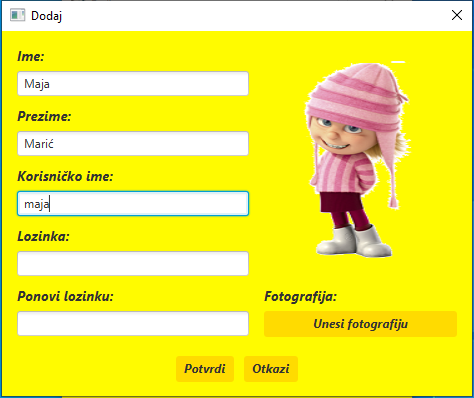
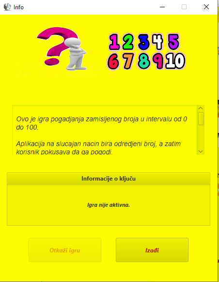
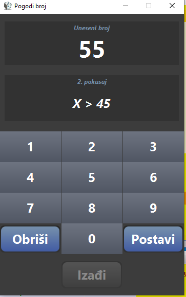
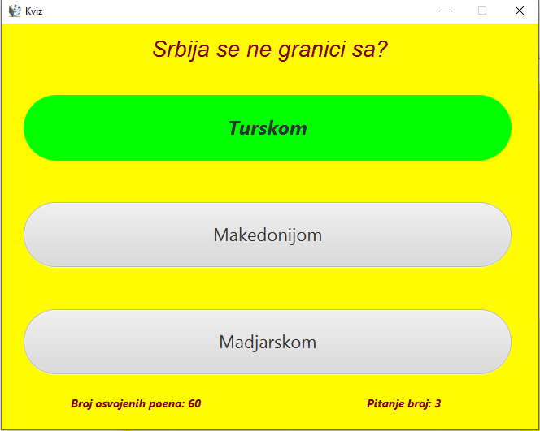
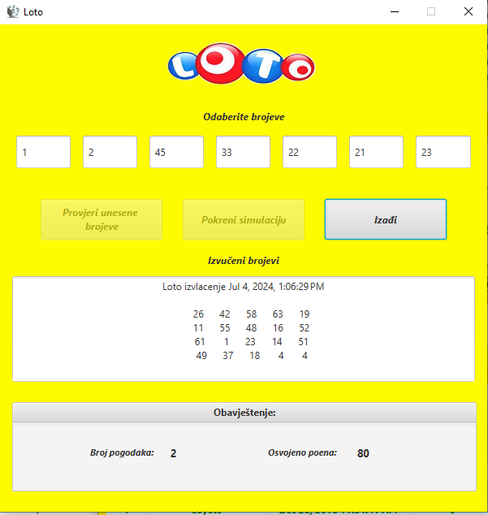

<div align="center">
  <h1>Igralica</h1> 
</div>
<br>

<div style="page-break-before: always;"></div>


**Igralica** je desktop GUI aplikacija napravljena u Javi koja korisnicima omogućava igranje jednostavnih, klasičnih igara nakon registracije, prijave na sistem i unosa odgovarajućeg licencnog ključa.

Aplikacija demonstrira praktičnu primjenu objektno-orijentisanog programiranja u Javi: enkapsulaciju domenskog modela, serijalizaciju objekata, rad sa fajl-sistemom, bezbjedno čuvanje lozinki i izgradnju višeprozorskog GUI-ja u JavaFX-u.

<div align="center">
  
</div>

---

## 🎮 O aplikaciji

Nakon pokretanja, korisnik se registruje (ime, prezime, korisničko ime, lozinka, profilna fotografija) ili se prijavljuje na postojeći nalog. Poslije prijave otvara se glavna strana sa koje se:

- unose licencni ključevi kojima se otključavaju pojedine igre,
- pokreću otključane igre,
- prati broj bodova na profilu,
- pregleda rang lista rezultata po igrama,
- izvozi kompletna istorija odigranih partija u CSV fajl.

Svaki novoregistrovani korisnik dobija **10 početnih bodova**, a bodovi se dijele između svih igara — mogu biti i negativni.

---


## 👤 Korisnički nalozi i bodovi

- Registracija zahtijeva jedinstveno korisničko ime, lozinku dužu od 4 karaktera (uz potvrdu lozinke) i profilnu fotografiju.
- Lozinke se **nikad ne čuvaju u čistom tekstu**: heširaju se algoritmom `PBKDF2WithHmacSHA512` (10 000 iteracija, 256-bitni ključ) uz nasumično generisanu so, i tek tako kodovane u Base64 upisuju u `Lista korisnika.txt`.
- Nalog i bodovi se čuvaju nezavisno od trenutne sesije, tako da se stanje profila zadržava između pokretanja aplikacije.

<div align="center">
  &nbsp;
  
</div>

---

## 🔑 Sistem ključeva i licenciranje igara

Da bi se igra pokrenula prvi put, korisnik mora unijeti ključ namijenjen toj igri. Ključ je niz od 16 cifara u 4 grupe odvojene crticom (npr. `1111-1111-1111-1111`), a njegov tip trajanja određuje koliko dugo igra ostaje aktivna:

| Trajanje | Enum vrijednost |
|---|---|
| 1 sat | `SAT` |
| 1 dan | `DAN` |
| 7 dana | `SEDMICA` |
| Neograničeno | `NEOGRANICENO` |

Kada korisnik unese ispravan i dostupan ključ, on se trajno vezuje za njegovo korisničko ime i mijenja status u `AKTIVAN`. Nakon isteka trajanja ili ručnog otkazivanja igre, ključ prelazi u status `ISKORIŠĆEN` i više se ne može ponovo iskoristiti — ni od istog, ni od drugog korisnika. Set demonstracionih ključeva (za sve tri implementirane igre, u sve četiri varijante trajanja) generiše se i serijalizuje pomoću pomoćne klase `KreiranjeKjuca`.

<div align="center">
  
</div>

---

## 🕹️ Igre

### 1. Pogodi broj
Aplikacija zamisli broj između 1 i 100, a korisnik ima **5 pokušaja** da ga pogodi uz povratnu informaciju "veći/manji". Nema gubitka bodova za promašaj — pogotkom se osvaja `100 / broj_pokušaja` bodova.

<div align="center">
  
</div>


### 2. Kviz
Korisniku se postavlja **5 nasumično odabranih pitanja**, svako sa po 3 ponuđena odgovora. Tačan odgovor nosi +20 bodova, netačan -30 bodova, a savršen rezultat (5/5) donosi dodatnih +50 bodova bonusa.

<div align="center">
  
</div>

### 3. Loto
Za pokretanje igre korisnik ulaže **100 bodova**. Bira 7 različitih brojeva u opsegu 1–70, nakon čega aplikacija na slučajan način izvlači 20 brojeva. Za svaki pogođeni broj se dobija `redni_broj_pogotka × 10` bodova, a pogodak svih 7 brojeva donosi dodatni bonus od 100 bodova.

<div align="center">
  
</div>

---

## ⚖️ "Pametno" balansiranje rezultata

Zanimljivost implementacije: aplikacija blago koriguje ishod partije za iskusnije igrače kako bi dugoročni prosjek ostao fer. Kod korisnika koji su odigrali više od 3 partije i imaju preko 40% uspješnosti:

- u igri **Pogodi broj**, ako bi peti (poslednji) pokušaj bio pogodak, aplikacija — samo ako je to i dalje moguće bez odavanja trika (broj +1 ili -1 od traženog nije već bio unesen) — u posljednjem trenutku "pomjeri" traženi broj za jedan i javi promašaj;
- u igri **Loto**, brojevima koji nose 30, 50 i 60 bodova daje se 50% šanse da, čak i ako ih je korisnik pogodio u početnom izvlačenju, budu zamijenjeni drugim brojem prije prikaza rezultata.

Cilj ove mehanike je da prosječan broj izgubljenih bodova u ovim igrama bude oko 40% veći od prosječnog broja osvojenih, umjesto da igrač sistematski profitira.

---

## 📊 Statistika, rang lista i izvoz podataka

- Za svaku igru posebno se prikazuje rang lista top 10 rezultata (pozicija, ime igrača, datum, broj bodova), sortirana silazno po broju osvojenih bodova.
- Kompletna istorija svih odigranih partija (svih korisnika) može se izvesti u CSV fajl jednim klikom, sa kolonama: korisničko ime, vrsta igre, datum igranja, broj poena.

---

## 💾 Perzistencija podataka

Aplikacija ne koristi bazu podataka — sve se čuva na fajl-sistemu, u folderima koji se nalaze uz izvršnu aplikaciju (folder `app/` u repozitorijumu):

| Putanja | Sadržaj |
|---|---|
| `Lista korisnika/Lista korisnika.txt` | Korisnički nalozi (ime, prezime, korisničko ime, so, heš lozinke, putanja do slike) |
| `Slike korisnika/` | Profilne fotografije korisnika |
| `Bodovi korisnika/Bodovi korisnika.ser` | Trenutni broj bodova po korisničkom imenu (serijalizovana mapa) |
| `Lista kljuceva/Lista kljuceva.ser` | Svi licencni ključevi i njihov status (serijalizovana mapa) |
| `Lista pitanja/Lista pitanja.txt` | Banka pitanja za kviz |
| `Rang lista/Rang lista.ser` | Istorija svih odigranih partija, za rang liste |
| `Statistika/` | CSV izvještaji koje korisnik sačuva |

Greške tokom rada se bilježe u `Zabiljeske/log.xml` pomoću `java.util.logging.FileHandler`.

---

## 💻 Tehnologije i alati

- **Jezik:** Java
- **GUI biblioteka:** JavaFX (FXML + CSS stilizacija)
- **Bezbjednost:** `javax.crypto` — PBKDF2WithHmacSHA512 heširanje lozinki uz nasumičnu so
- **Perzistencija:** Java serijalizacija (`.ser`), tekstualni i CSV fajlovi
- **Logovanje:** `java.util.logging` sa upisom u XML fajl
- **Razvojno okruženje:** Eclipse (bez Maven/Gradle build sistema)

---

## 🚀 Kako pokrenuti projekat lokalno

### Preduslovi

- Instaliran **Java JDK**
- Preuzet **JavaFX SDK** (nije uključen u sam JDK od verzije 11 naviše)

### Uvoz i pokretanje

1. Klonirajte repozitorijum i uvezite folder `app` kao postojeći projekat u Eclipse (ili drugo IDE po izboru).
2. U konfiguraciji pokretanja (Run Configuration / VM Options) dodajte JavaFX module:

```
--module-path /putanja/do/javafx-sdk/lib --add-modules javafx.controls,javafx.fxml
```

3. **Važno:** postavite radni direktorijum (Working Directory) konfiguracije pokretanja na folder `app/`. Aplikacija čita i upisuje podatke (korisnici, ključevi, bodovi, pitanja...) na relativne putanje u odnosu na radni direktorijum, pa pokretanje iz pogrešnog foldera onemogućava učitavanje tih fajlova.
4. Pokrenite klasu `igralica.application.PokretanjeAplikacije`.

---

